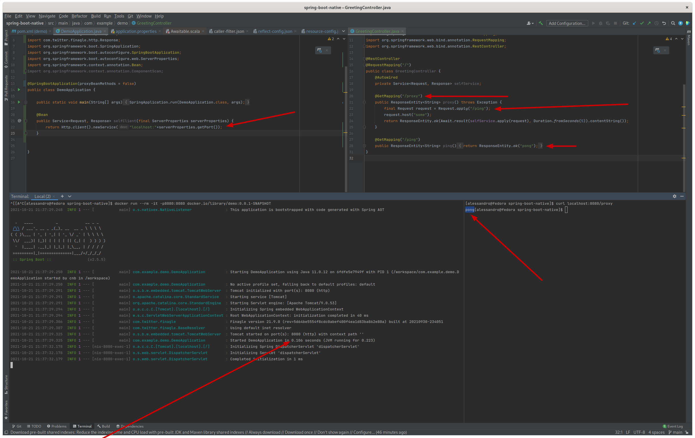

# Spring Boot + Spring MVC + Finagle in a Native image

The goal of this repo is to show how to use Finagle (netty) based in a Spring Boot app.
The first attempt was made in April 2020 and failed. Now due to the hard work of everyone at Graal, Spring (Boot) and the Spring native-image project, and netty it is rather trivial to add Finagle.

## It works



##Test setup

* Fedora 34
* GraalVM 21.2.0 installed through sdkman (21.3.0 generates fields incompatible with 21.2.0 which is the latest graal version available in the buildpacks used by Spring Boot native-image support/plugin)
* Docker CE (couldn't get the docker build pack to work with podman)

##Steps to reproduce

```shell
./mvnw spring-boot:build-image
```

```shell
docker run --rm -it -p8080:8080 docker.io/library/demo:0.0.1-SNAPSHOT
```

And then in another process or from a browser:

```shell
> curl localhost:8080/proxy
pong
```

##Todo

* Prove that it also works with the JCE TLS
  * Maybe get the tcnative binaries for ssl to work (e.g. the boringssl one)
* ???
* Test how to do the development on mac (e.g. what is the effect on the assisted configuration generation.)